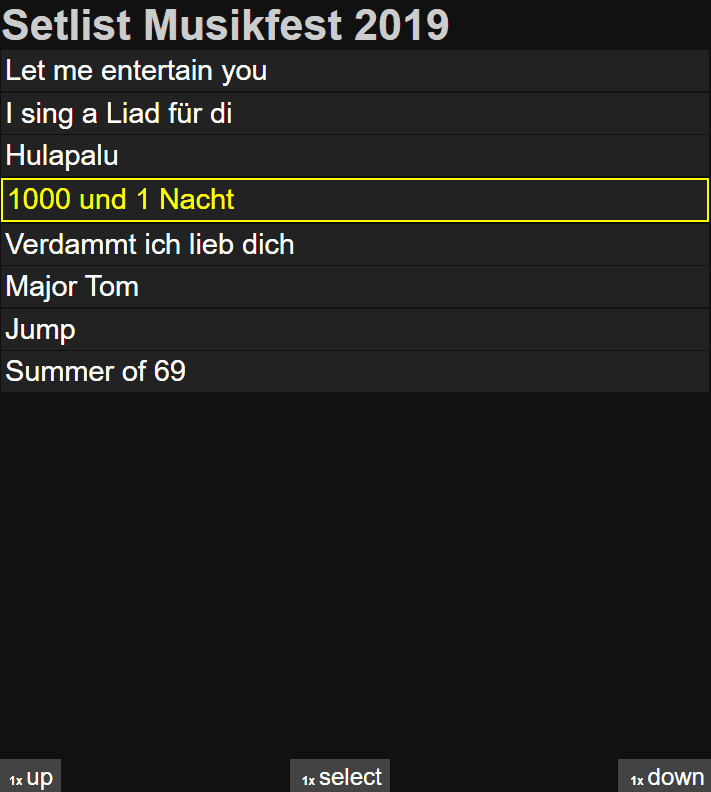

# Onstage Text Monitor build with Raspberry PI

## Hardware

- Raspberry Pi* (~30 €)
- (Old) Computer Monitor
- [3x Key Foot Switch](https://www.amazon.de/KKMOON-Schwarz-Fu%C3%9Fschalter-Fu%C3%9Fpedal-Fu%C3%9Ftaster/dp/B00WS2GZU2/) (~26€)
- Cables
- Custom built box of wood

\* I chose an *Raspberry Pi 4B 1GB RAM* but of course you can use other versions as well.

## Software
